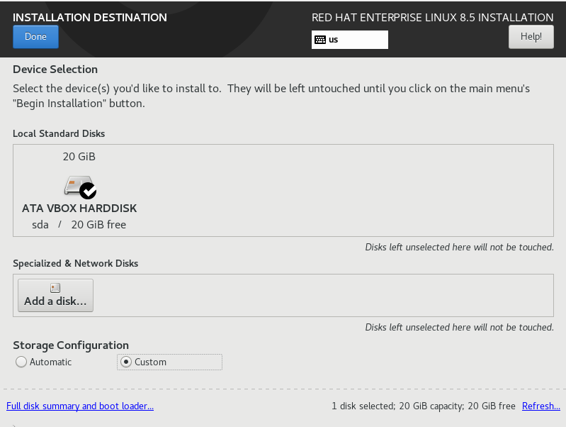
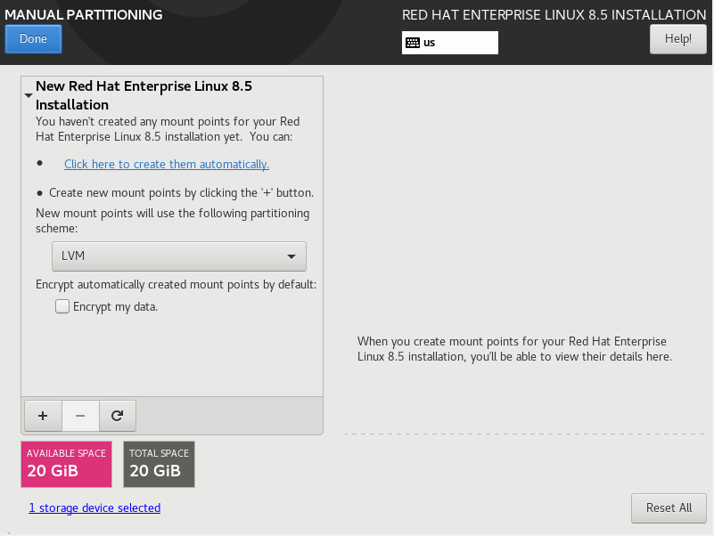
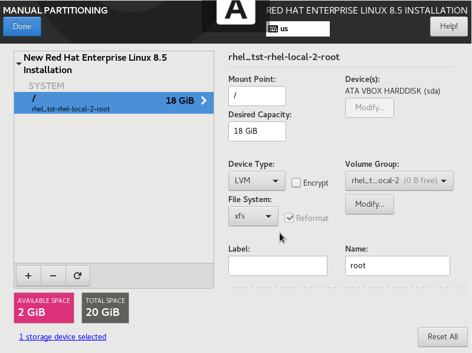
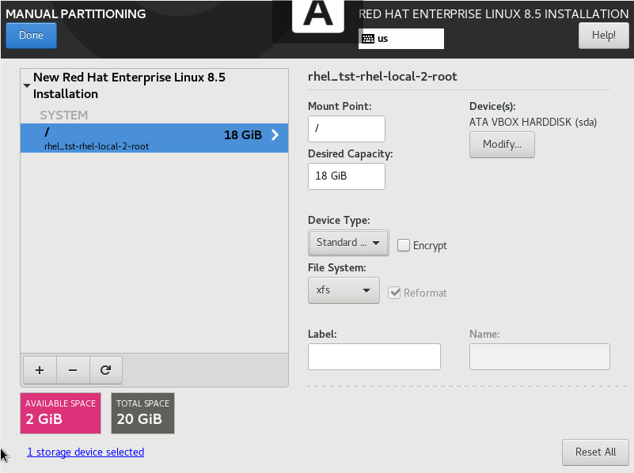
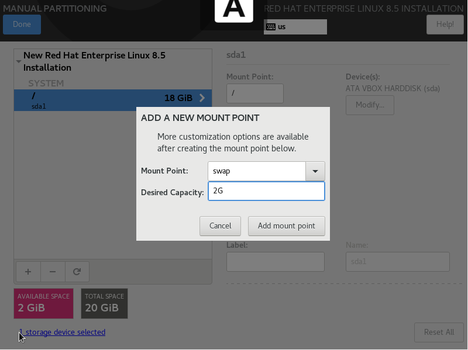
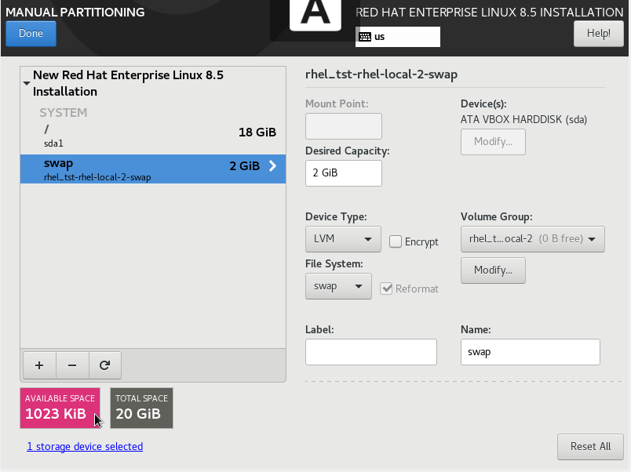
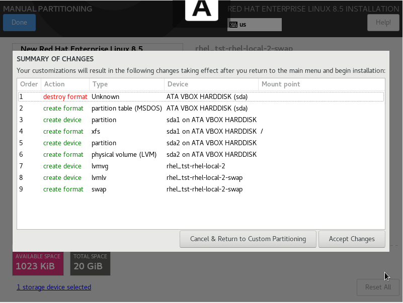
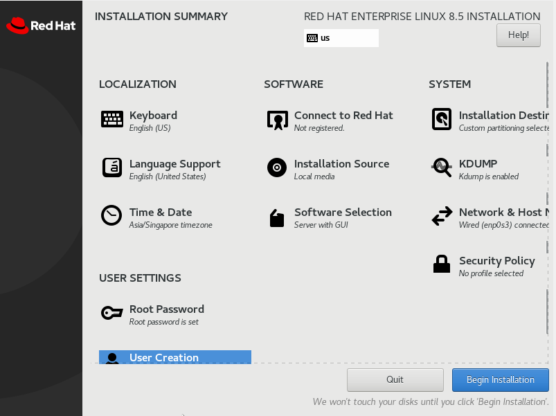
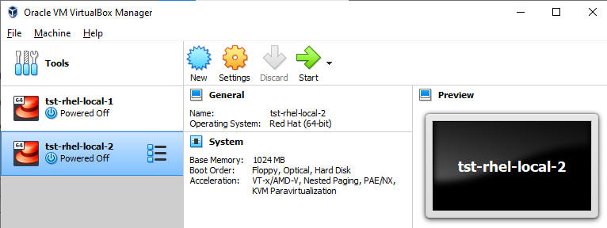

# Lab 2: Installation with Custom Partitioning

> *This lab is based on [Red Hat Certified System Administrator (RHCSA), 3/e by Sander van Vugt](https://www.oreilly.com/library/view/red-hat-certified/9780135656495/)*

This follows the same steps as the previous lab but this time we'll be configuring a custom partitioning. Follow the steps in Lab 1 (under "RHEL on VirtualBox" section) up to **Step 9: Confirm the Installation Destination**.

Note that for this lab, we changed our hostname to **tst-rhel-local-2**.

## Setting up the partitions

1. In the **Installation Destination** menu, go down to the **Storage Configuration** at the bottom and select **Custom** and then **Done**.

2. We can then change the partitioning in the next menu. At the bottom, select the '+' sign to add new mountpoints. Think of adding mount points as 'adding USB ports in your laptop'. The more mount points or ports you have, the more devices that can be plugged in. 

3. For this one, we'll just configure for the first mount point where our root OS will be installed. Select '/' for **Mount Point** and put in '18G' for **Desired Capacity**. Hit **Add Mount Point**.

4. On the right side, notice the **Device Type**. Note that we can only launch and boot up from a **Standard partition** device. When we change the device type, the filesystem will also change to xfs. RHEL 8 defaults to xfs.

5. For the remaning 2 GB, we'll use it as **swap space**. Think of it as a buffer or extra space that is utilized when the RAM is full. It is like helper that assists the RAM offload some of its irrelevant or inactive pages. To add a swap space, just repeat the same step but specify **swap** for the mount point and '2Gb' for Desired Capacity.

6. Notice that after we've configured 18GiB for the root partiion and 2GiB for the swap partition, we still have **1023KiB Available Space**. [Magic, isn't it?](https://www.quora.com/What-is-the-reason-behind-using-1-024-in-KB-MB-GB-TB-PB-memory-Where-does-this-1-024-belong-to) 😁

7. At this point, we can select **Done**. It will show the summary of changes. These are the list of modifications that the system will apply. Hit **Accept changes** then **Done**. Afterwards, **Begin Installation**.

8. Once we're done, we'll now have two local VMs on our VirtualBox. 

9. Note that we'll be using AWS EC2 instances for the majority of the labs in this series but we'll come back to this two local VMs on some labs that require interaction on the underlying OS. For setting up EC2 instances, you can check out the previous lab.

## References

- [Tips for Linux Newbies: Understanding Swap Space](https://www.wired.com/2007/12/tips-for-linux-newbies-understanding-swap-space/)
- [How does swap space work?](https://www.computerworld.com/article/2794697/how-does-swap-space-work-.html)
- [What is the reason behind using 1,024 in (KB, MB, GB, TB, PB) memory? Where does this 1,024 belong to?](https://www.quora.com/What-is-the-reason-behind-using-1-024-in-KB-MB-GB-TB-PB-memory-Where-does-this-1-024-belong-to)

As always, happy learning! 😀
