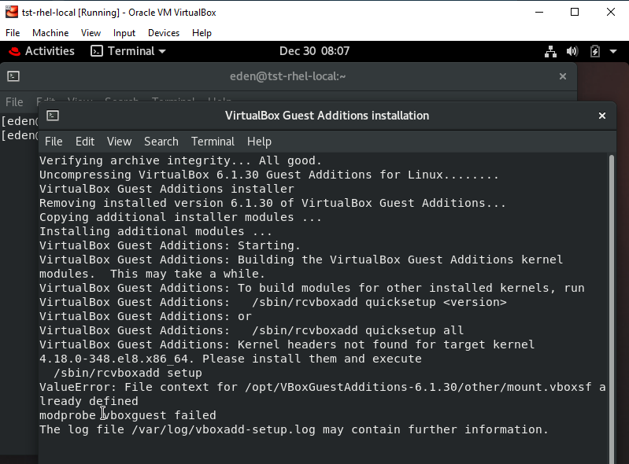

# Lab 03: Copying across host and guest machine + Installing important packages

Thought I'd include this part since I used VirtualBox VMs in some of the labs in this series. I was having issues copying text from my laptop and then pasting them onto the terminal inside the VM (and then vice versa).

I've also included some packages that would be helpful. Some setup doesn't come with pre-built packages like vim.

## The Shortcut:

If you prefer to skip the lengthy reading, here is the summary of commands I ran. This can also be turned into a script. 

<details><summary> Read more... </summary>
<br>

Summary of commands:

```bash
sudo dnf upgrade
sudo rm -r /var/cache/dnf
sudo dnf install -y vim bash-completion firewalld mlocate
sudo dnf install -y gcc make perl kernel-headers kernel-devel elfutils-libelf-devel.x86_64
sudo dnf update -y
sudo reboot
```

What does these commands do?

- Install vim, firewalld, if they don't come pre-installed yet
- Install requirements for VBOX additions, which allows copying of text across host machine and the VMs.
- Updates all presently installed packages

Note that after you reboot, you need to click **Devices** tab on the Virtualbox VM and enable "bidirectional" on the following options

- Drag and Drop
- Shared Clipboard

<p align=center>

</p>

<p align=center>

</p>

</details>

## The Detailed Steps

If you prefer to know the steps I did (and the errors I encountered along the way), click the **Read more** below.

<details><summary> Read more... </summary>

### Enable bidirectonal on the VM menu

On the **Devices** tab, I set both **Shared Clipboard** and **Drag and Drop** to **bidirectional**. Then rebooted it.

<p align=center>

</p>

<p align=center>

</p>

Normally, this would allow the copying and pasting of text across the host and guest machine. But since this didn't worked, I had to install the Guest Additions.

### Install Guest Additions

On the **Devices** tab, click **Insert Guest Additions CD Images..**.

<p align=center>

</p>
<p align=center>

</p>
<p align=center>

</p>

However, I keep getting this error:
<p align=center>

</p>

So I tried running the command, and then inserting the guest additions image again.
<p align=center>

</p>
<p align=center>

</p>

Then I got a new error message. I went to the **Optical Drives** to force unmount the disk and tried to insert the guest additions image again. This required the authentication again.
<p align=center>

</p>
<p align=center>

</p>
<p align=center>

</p>
<p align=center>

</p>

I still got the same error.

<p align=center>

</p>


### Error 1/3: Kernel Headers Not Found For Target Kernel Error [RESOLVED]

Google time. Went online and found [this](https://www.dev2qa.com/how-to-resolve-virtualbox-guest-additions-kernel-headers-not-found-for-target-kernel-error/).

```bash
ls /usr/src/kernels/
sudo yum install -y "kernel-devel-uname-r == $(uname -r)"
```

<p align=center>

</p>

This need to be resolved first. Followed suggestions from [RH discussion](https://access.redhat.com/discussions/4656371), but this didn't helped.
Then I tried to compare the two repo file. Turns out I was using "zero" for "Base0S" instead of "BaseOS". Corrected this and run the new commands using dnf instead of yum.

```bash
sudo dnf clean all
sudo rm -r /var/cache/dnf
sudo dnf upgrade
```

<p align=center>

</p>

Went back to the original issue and re-run the install again.

```bash
sudo dnf install -y "kernel-devel-uname-r == $(uname -r)"
```

<p align=center>

</p>

Then retried adding guest additions again using the same steps:

<p align=center>

</p>

This time it showed a different error.

<p align=center>

</p>
-

### Error 2/3: Please install the gcc make perl packages from your distribution [RESOLVED] 

Following another link: [Guest additionals: Kernel headers not found for target kernel](https://superuser.com/questions/1532590/guest-additionals-kernel-headers-not-found-for-target-kernel)

```bash
sudo dnf install -y gcc make perl kernel-headers kernel-devel
```

<p align=center>

</p>
<p align=center>

</p>
<p align=center>

</p>

Rebooted afterwards, then tried installing Guest Additions again.

<p align=center>

</p>


Got a new error:

<p align=center>

</p>


### Error 3/3: Look at /var/log/vboxadd-setup.log to find out what went wrong [RESOLVED]

A quick Google search showed this: [elfutils-libelf-devel.x86_64 package on CentOS 8 / RHEL 8](https://linux-packages.com/centos-8/package/elfutils-libelf-develx86-64)

Followed it and then rebooted afterwards.

```bash
sudo dnf install -y elfutils-libelf-devel.x86_64
```

Tried installing the guest Additions again.


### Success!

After installing the **gcc, make**, **elfutils**, and doing the rest of the other previous steps, and restarting for the last time, I was able to finally copy and paste across my laptop and VMs in VIrtuaBox.

</details>


## References

- [How to enable copy and paste in VirtualBox](https://www.techrepublic.com/article/how-to-enable-copy-and-paste-in-virtualbox/)
- [Installing multiple packages with one yum command](https://unix.stackexchange.com/questions/7638/installing-multiple-packages-with-one-yum-command)


As always, happy learning! 😀
