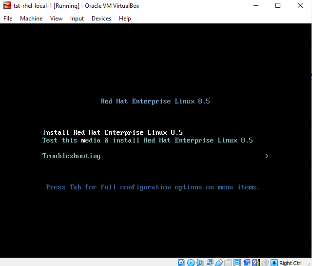

# Lab 1: Basic Installation - RHEL on VirtualBox and AWS

> *This lab is based on [Red Hat Certified System Administrator (RHCSA), 3/e by Sander van Vugt](https://www.oreilly.com/library/view/red-hat-certified/9780135656495/)*

There are various ways to setup Red Hat Enterprise Linux (RHEL) for your personal lab:

- cloud providers
- bare metal servers
- local VMs (VirtualBox, VMware Workstation)

For this series of labs, we'll be utilizing:

- a VM in VirtualBox VMs
- an Amazon EC2 instance

## RHEL on VirtualBox

I used VirtualBox along with GNS3 a few years ago when I studied for a Cisco exam. I then left it and didn't touch it until I decided to prepare for the RHCSA exam. Opening the application again, it prompted about the new version so I had to update it to the new version, which is 6.1.30. 

 To know how to configure the RHEL Virtual machine, read more

 

Begin by installing VirtualBox on your local machine. We will also need to download the free-to-use Red Hat Enterprise Linux image. 

- [How to Install VirtualBox](https://www.wikihow.com/Install-VirtualBox)
- [VirtualBox Download](https://www.virtualbox.org/wiki/Downloads)
- [Free-to-use RHEL image](https://developers.redhat.com/products/rhel/download)

### Configuring RHEL on VirtualBox

1. Open your VirtualBox application. You should see the Virtualbox Manager menu.

2. To add an image, click **New**. It will prompt you to enter a name for your VM. The distro is also detected, but you can change it. Click **Next**.

3. Next, setup the specifications of your VM. You can simply use the defaults and click **Next > Create > Next**.

4. For the virtual hard disk, we can set it to 20GB since the images would normally need more than 12 GB. Click **Create** and the window will close. Select the VM and click **Settings**.

5. Select **Storage > Empty** then click the CD icon beside the **Optical Drive** dropdown bar. The RHEL ISO file should appear here. If not, click **Choose/Create a Virtual Optical Disk** and select the RHEL ISO file. Click **OK**.

6. Double-click the VM to start it. You should now be see the installation page. Select the **Install** option. This will take a few minutes.

6. Next step is to set the language and other system configuration.

7. The **Time & Date** can also be set in this menu.

8. Similarly, the **Network and Hostname** can also be modified. After changing the hostname at the bottom, click **Apply**.
Enable the Ethernet card by toggling **On**. The NIC should auto-populate with the IP, DNS Route, and DNS.

9. Confirm the **Installation Destination**. We'll set up a second machine in the next Lab and set up custom partitioning. For this one, just click **Done**.

10. Set the **Root Password**.

11. Create a user through **User Creation**.

11. Finally, click **Begin Installation**. This will take a while. After this is done, **Reboot system**.

12. After VM is rebooted, you may be prompted to accept the licensing. Afterwards, click **Finish configuration**.

13. You will then be brought to the sign-in page. Login using **root**. You will be prompted to select a language and a few more settings before you're able to **Start using Red Hat Enterprise Linux**.

14. As a final step, make sure to remove the ISO file for now. If the ISO file is still loaded and system is rebooted, you will be prompted to go through the entire boot process again.

More details about it here: [Oracle VM make me install Ubuntu every time I restart the virtual machine [closed]](https://stackoverflow.com/questions/60582106/oracle-vm-make-me-install-ubuntu-every-time-i-restart-the-virtual-machine)

## RHEL on the cloud

As another option, you can also run Linux boxes on the cloud. This is also my preferred method since it doesn't consume resources from my laptop and instead uses the resources from the cloud provider.

 To know how to configure EC2, read more 

 

Note that you may need to setup the **VPC** and all of its associated comoponents as well. This is useful for the succeeding labs in this series where we'll launch two or more machines that needs to talk to each other.

Setting up VPC will let you set up your own mini-private network where you will put all your instances.

To set up a Virtual Private Cloud (VPC), you can check out the following resources. VPC is like your own personoal network where you can set up VLANs (in this case, they are similar to **Subnets launched on different Availability Zones**).

- [Get started with Amazon VPC](https://docs.aws.amazon.com/vpc/latest/userguide/vpc-getting-started.html)
- [Tutorial: Creating a VPC with Public and Private Subnets for Your Compute Environments](https://docs.aws.amazon.com/batch/latest/userguide/create-public-private-vpc.html)
- [Create an IPv4-enabled VPC and subnets using the AWS CLI](https://docs.aws.amazon.com/vpc/latest/userguide/vpc-subnets-commands-example.html)
- [How to Create AWS VPC in 10 steps, less than 10 min](https://varunmanik1.medium.com/how-to-create-aws-vpc-in-10-steps-less-than-5-min-a49ac12064aa)
- [AWS VPC Beginner to Pro - Virtual Private Cloud Tutorial](https://www.youtube.com/watch?v=g2JOHLHh4rI)

We can simply follow the official AWS documentation to launch our EC2 instance but I've also added some resources as well. Note that the AWS console updates from time to time and you may find some difference in the features in your console, but they're still there. 

- [Set up to use Amazon EC2](https://docs.aws.amazon.com/AWSEC2/latest/UserGuide/get-set-up-for-amazon-ec2.html)
- [How to Create a Red Hat Enterprise Linux EC2 Instance in Five Minutes](https://www.youtube.com/watch?v=7oZPy3ozFno)
- [Set Up AWS EC2 Instance: RedHat Enterprise Linux 8 (RHEL 8)](https://dzone.com/articles/set-up-aws-ec2-instance-redhat-enterprise-linux-8)

If you don't want to go through all the hassle of following lot of steps in setting up the VPC and instances (it can get too complicated easily), you can opt for **Cloudformation** templates which are easy-to-use and **can be launched in less than 5 minutes**. 

These are templates where the components are *declaratively* defined, you just need to launch it and Cloudformation takes care of the provisioning.

- [AWS CloudFormation VPC template](https://docs.aws.amazon.com/codebuild/latest/userguide/cloudformation-vpc-template.html)
- [AWS CloudFormation: Create a VPC with EC2 Instance](https://aws.plainenglish.io/aws-cloudformation-create-a-vpc-with-ec2-instance-34e27d59a842)
- [awslabs/aws-cloudformation-templates](https://github.com/awslabs/aws-cloudformation-templates/blob/master/aws/services/VPC/VPC_EC2_Instance_With_Multiple_Static_IPAddresses.yaml)
- [Creating EC2 instance in AWS with CloudFormation](https://octopus.com/blog/aws-cloudformation-ec2-examples)
- [aws-vpc-cloud-formation/base-vpc-example-improved.template.yml](https://github.com/kennyk65/aws-vpc-cloud-formation/blob/master/base-vpc-example-improved.template.yml)

## A few reminders

Here are some few quick reminders when setting up EC2 instances in the cloud.

- Utilize the free tier offering when you first sign-up for an AWS account.
- The free tier provides *selected free resources* for a year, which is more than enough for these series of labs.
- You will be billed based on the resources you spin up and consume.
- Note that Cloudformation is **free** but the resources that Cloudformation will provision is not free.
- For EC2 instances launched through the EC2 menu, you can simply delete them there.
- However, resources provisioned through Cloudformation can't be simply deleted through their menus. You would need to [delete the stack](https://docs.aws.amazon.com/AWSCloudFormation/latest/UserGuide/cfn-console-delete-stack.html).
- Lastly, I prefer AWS since I've saved up lots of credits by attending AWS events, which I suggest you attend as well. There are tons of activities on those events and of course, the free credits when you answer their survey.
- If you prefer to **use virtual machines on Microsoft Azure**, you can check this [link](https://docs.microsoft.com/en-us/azure/virtual-machines/windows/quick-create-portal)..
- If you prefer to **use VM instances on Google Cloud Platform**, you can check this [link](https://cloud.google.com/compute/docs/instances/create-start-instance).

As always, happy learning! 😀

