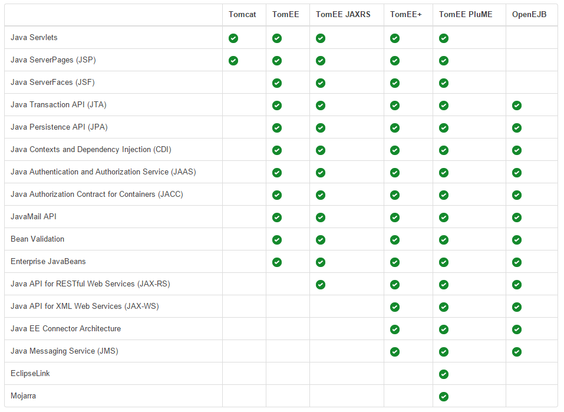

# Tomcat 

- [Introduction](#introduction)
- [How Tomcat Works](#how-tomcat-works)
- [Tomcat and its Uses](#tomcat-and-its-uses)
- [Tomcat Up and Running](#tomcat-up-and-running)
- [Tomcat Day-to-Day](#tomcat-day-to-day)

## Introduction 

Tomcat is a pure Java HTTPS web server environment in which Java code can run. It is an implementation of different technologies;

- [Java Servlet](#java-servlet)
- [JavaServer pages JSP](#javaserver-pages-jsp)
- [Java Expression Language](#java-expression-language)
- [Websocket](#websocket)

In addition to this, Tomcat is an Open Source software that is licensed under the Apache license. This means that users can distribute it, modify it, and distribute modified versions of the software under the terms of the [Apache Software Foundations license.](https://www.apache.org/licenses/)

To learn more about Tomcat and its uses, check out the [Tomcat deep dive](../pages/10-tomcat/00-tomcat-intro.md) page.


## Java Servlet

A Java servlet is a software component of Java that extends the capabilities of a server:

- "servlet" is a shorthand for **HTTP servlet**
- it can add dynamic content to a web server using the Java platform 
- commonly used to implement applications hosted on web servers
- content is normally HTML, but could also be XML 
- requires a **web container** (servlet container) to run
- other counterparts are PHP and ASP.NET

## JavaServer pages (JSP)

JSPs is a group of technolgies that helps a developer create dynamically generated web pages:

- high-level abstraction of Java servlets 
- JSPs are translated into servlets at runtime 
- they are cached and reused at runtime
- the web pages are based on HTML, XML, and other types 
- resulting page is compiled and executed on the server

To deploy an run a JSP, you need to use something compatible (a servlet container) suc as tomcat. They must be executed within a **Java Virtual machine (JVM)**

## Java Expression Language 

Known also as **Java Uniied Expression Language**, the Java Expression language is a special-purpose programming language mostly used in Java web applications for embedding expressions into web pages.

An **expression language** is designed to make it easy to acc  ess application data stored in JavaBeans components. It was originally called **SPEL** or "Simplest Possible Expression Language".

## Websocket 

A **Websocket** is a communications protocol which provides full-duplex communication over a single TCP connection.

- it can send content to the client without first getting a request from the client 
- enables persistent interactions between a web server and a web browser 
- connection remains open until the client or the server decides to close it
- although different from HTTP, it can also work over ports 80 and 443 
- it is good for low-latency applications

## How Tomcat Works 

Since Tomcat only work with WAR files, it is sometimes just referred as a web applications server instead of being an application server. 

It works by executing servlets and rendering web pages from thos servlets. Smallers applications used with Tomcat will work well, while others require the full use of a **Java Platform Enterprise Edition** application server.

Lastly, the Tomcat application server is not Java EE certified. This means it doesn't meet any of the conformity requirements such as inherent support for many useful enterprise development APIs such as CDI, Java Transaction API, JavaServer Faces (JSF), Hibernate and JPA. 

However, it is possible to add support for APIs such as JSF and CDI to Tomcat by integrating projects like Weld and Mojarra. A separate Apache project named TomEE allows for this support, but the basic Apache Tomcat download does not.

  

To learn more, check out [Tomcat vs. JBoss.](https://www.theserverside.com/video/Tomcat-vs-JBoss-Compare-features-of-these-Java-app-servers)

## Tomcat and its Uses 

As previously mentioned, Tomcat is a "pure Java" HTTP web server environment in which Java code can run.

- it is a web server and a servlet system 
- can be used as an HTTP server
- it is required to run Java web applications 
- multiple servlets or sites can be run on the same server 
- different servlets or sites can be managed separately 

Often used with load balancers as front end , you can also use Apache web server with **mod_proxy** or **Varnish** to forward traffic to port 8080. 

As for TLS/SSL configuration, most implementations of Tomcat will use a separate front end and direct the traffic as required. 

## Tomcat Up and Running  

It is important to note that Tomcat requires Java, which makes sense because it runs Java web applications. It also uses port 8080 by default, but this can be changed in the configuration files.

Tomcat also has a web-based administration console which can be accessed through:

```bash
http://localhost:8080/manager  
```

Before you can access the administrative features, you will need to add users first. 

Once Tomcat is up and running, it is easy to deploy your Java application. You just need to place the **.war** file into the **/webapps** folder.


## Tomcat Day-to-Day 